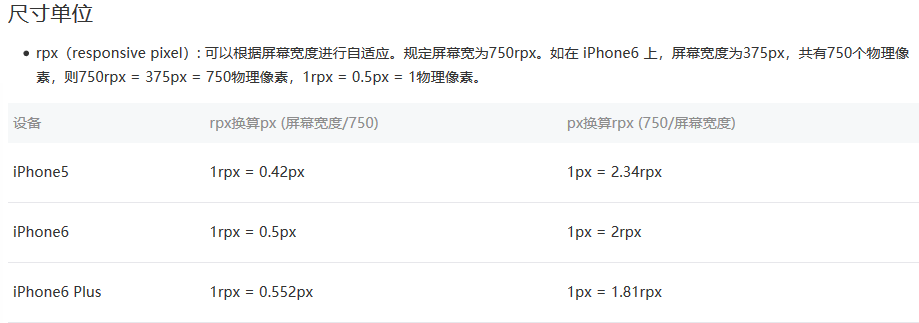
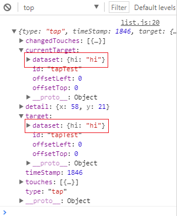

# 微信小程序小结


body --> pages

div --> view 容器组件

img -- > image 图片组件

span --> text 文字组件

block --> Vue template 

> 小程序其实就是由多个 html 文件构成。
>
> block 与 template 类似，都是为了更方便的开发而出现，能够方便的应用列表循环的能力，且不会被渲染到页面中去。


### wx 的自适应单位 rpx

不同手机的页面大小不同，微信小程序为此提供了 rpx 值来进行自动的适配：



> 对于图片、文字、元素的自适应问题，本来要依靠 vw、vh 或者是全部用 rem 最后添加 @media 来适配，但没想到微信提供了一个更好的方案，即仅存在于微信小程序中的 rpx，有这东西就能轻松的自适应了。可以认为 rpx 就是自动帮助我们计算了不同屏幕尺寸的大小，并将 px 自动转换成对应尺寸的大小，这本来是我们使用 rem 之后用 @media 来适配的事情，现在自动化了。


### 空格问题

1. 设置 space 属性为 true，此时内部空格全部生效。
2. 设置 decode 为 true，这将启用常规 html 中对 &nbsp 的转码为空格的作用。

> 一般情况添加 space 最方便，但如果需要特别的大小的空格，启用 decode 更好。


### 类 hover 的点击态 hover-class

手机上一般是没有鼠标的，更多的是点击，点击时要产生效果，并且在之后自动消逝，这跟 CSS 中的 hover 移入时产生效果，移出后自动消失是一样一样的。

设置 hover-stop-propagation 为 true 可防止点击事件冒泡。


```html
<view hover-stop-propagation="true">点击态</view>
```

也可以设置其显示跟消失的时间，单位是 ms：

```html
<view hover-start-time="50" hover-stay-time="400">点击态</view>
```


### 图片的自适应：

设置 image 标签的 mode="widthFix"，宽度不变，高度自动变化，保持原图宽高比。

> 同理还有裁剪、填充模式


### [路由](https://developers.weixin.qq.com/miniprogram/dev/framework/app-service/route.html)

路由较繁复，与 Vue 跟 history 都不太一样。

### 样式绑定

内联的样式绑定跟 VUE 是不同的，其他数据绑定的方式都一样：

WX：

```html
<view style="color:{{color}};" />
```

VUE：

```vue
<div v-bind:style="{ color: activeColor, fontSize: fontSize + 'px' }"></div>
<div v-bind:style="styleObject"></div>
<div v-bind:style="[baseStyles, overridingStyles]"></div>
```

### 设置双向数据流 

请使用 this.setData 来设置数据，否则页面完成之后进行设置数据，页面与数据不会有同步，要有响应的效果需要用 setData 来进行触发。


### 数据请求

数据请求需要用 wx.request({}) 的方式


### 列表循环

列表循环比 VUE 更精简，默认的 item 跟 index 与 *this(指代 item) 可以省去不少力气。不过微信并没有要求绑定 key 值，而是显示一个性能警告，VUE 不绑定 key 就要报错。

```html
<view wx:for="{{data}}" wx:key="index">{{item}}-{{index}}|</view>
<view wx:for="{{data}}" wx:key="*this">{{item}}-{{index}}|</view>
```

`wx:key` 的值以两种形式提供

1. 字符串，代表在 for 循环的 array 中 item 的某个 property，该 property 的值需要是列表中唯一的字符串或数字，且不能动态改变。
2. 保留关键字 `*this` 代表在 for 循环中的 item 本身，这种表示需要 item 本身是一个唯一的字符串或者数字。

> 不强制 key 值，孰好孰坏看个人，只要明白不添加 key 时 diff 算法会慢一丢，数量太多可能会引发性能问题就 OK。


## 事件


### 冒泡事件与捕获事件

* bind:tap/bindtap="foo" 冒泡
* catch:tap/catchtap="foo" 捕获

写在同一文件夹内的与 html 同名的 js 文件中，其事件的回调函数会自动绑定 js 文件中对应名字的回调函数。


### 通过事件触发来获取写在标签的数据


跟 html 上一样，事件内部会传递一个 event 的句柄，不同的是微信会将自定义属性前缀为 data-* 的属性给存起来，会保存到 event 的 dataset 属性上。可以查看  event 中的 target 或 currentTarget 上的 dataset 来获取对应上自定义的属性。

wsml：

```html
<view id="tapTest" data-hi="hi" bindtap="hi">Click me!</view>
```

js：

```js
hi(e) { console.log(e) },
```




由于一般没有鼠标，onmousemove 这种 API 的名字就不太适宜了，微信小程序使用 touchmove 来进行代替，其他同理。


WXS

基本的写法：

```js
// /pages/comm.wxs

var foo = "'hello world' from comm.wxs";
var bar = function(d) {
  return d;
}
module.exports = {
  foo: foo,
  bar: bar
};
```

相当于脚本生成数据，然后渲染到 html，方便是更方便了，但不知道值不值得，因为学这种语法在其他地方是不通用的，操作 DOM 或者是通过 MVVM 的方式才是通用了。

严肃的正则 API：

```js
var a = getRegExp("x", "img");
console.log("x" === a.source);
console.log(true === a.global);
console.log(true === a.ignoreCase);
console.log(true === a.multiline);
```


### [原生组件](https://developers.weixin.qq.com/miniprogram/dev/component/native-component.html)

小程序中的部分组件是由客户端创建的原生组件，这些组件有：

- [`camera`](https://developers.weixin.qq.com/miniprogram/dev/component/camera.html)
- [`canvas`](https://developers.weixin.qq.com/miniprogram/dev/component/canvas.html)
- [`input`](https://developers.weixin.qq.com/miniprogram/dev/component/input.html)（仅在focus时表现为原生组件）
- [`live-player`](https://developers.weixin.qq.com/miniprogram/dev/component/live-player.html)
- [`live-pusher`](https://developers.weixin.qq.com/miniprogram/dev/component/live-pusher.html)
- [`map`](https://developers.weixin.qq.com/miniprogram/dev/component/map.html)
- [`textarea`](https://developers.weixin.qq.com/miniprogram/dev/component/textarea.html)
- [`video`](https://developers.weixin.qq.com/miniprogram/dev/component/video.html)

slot

mutipleSlot: true


对缓存的读取


原生组件：video 与覆盖动画

原生组件：音乐播放器


组件与组件复用

behavior 构造器


动图的封装

封装 request 函数

数据加载的锁区