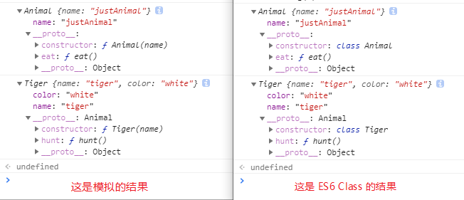

# ES5 模拟 class

[[toc]]

* 这篇文章的目的？

模拟实现 ES6、ES7 class 的效果，以增强 ES 编程能力。

* 这篇文章是怎么写的？

利用 babel，如果能够完全理解 babel 将 class 编译为 ES5 的代码，那也就相当于完成了一个 ES6 class。

> 写的时候线上版本的 babel 为 7.4.3，不同版本可能有不同实现。

打开 babel 网站，里面有一个在线的用 babel [ES6 转 ES5 的编译器](https://babeljs.io/repl)。

然后填入下面 ES6 的 Class 代码，任务就是用 ES5 完成类似的功能了。

```js
class Animal{
  static staticFoo = function staticFoo(){console.log("staticFoo")}
  static staticNum = 10
  constructor(name) {
  	this.name = name || "Animal"
  }
  eat() {console.log("eat")}
}

class Tiger extends Animal{
  constructor(name) {
   super(name);
   this.color = "white";
  }
  hunt() {console.log("hunting!")}
}

var a = new Animal("justAnimal");
var t = new Tiger("tiger")

console.log(a)
console.log(t)
```

:::tip

本文将 Animal 当为父类，Tiger 作为子类。 

:::

## 思路


1. 必须要通过 new 的方式来执行，否则报错：

   ```js
   class Animal{constructor(){}}
   Animal(); // Uncaught TypeError: Class constructor a cannot be invoked without 'new'
   ```

2. 静态属性和方法默认是不可枚举的：

   ```js
   var a = new Animal("justAnimal");
   var t = new Tiger("tiger")
   Object.keys(a) // ["name"]，方法和静态属性都不会被枚举
   Object.keys(t) // ["name", "color"]，一样
   ```

3. 静态属性和静态方法要放到定义静态的类上，而非静态方法只会出现在实例上：

   ```js
   var a = new Animal("justAnimal");
   var t = new Tiger("tiger")
   Animal.staticFoo() // 类上存在 staticFoo()
   a.staticFoo() // 报错，a.staticFoo is not a function
   ```

4. 子类要能调用父类的构造函数。

5. 子类要能从父类继承方法和属性。

---

1. 检查 new，可以检查一下传入的作用域 this 是否属于当前这个类的原型链上，只需要 `this instanceof Animal` 即可，这还能够允许子类调用父类的构造函数，因为当 `subClass instanceof superClass` 是能够通过的：

   ```js
   var a = new Animal("justAnimal");
   var t = new Tiger("tiger")
   Animal.call(t, "123") // 成功，name==="123"
   Tiger.call(a, "123") // 失败，报错
   ```

2. 当知道如何操作一个对象的数据描述符，也就知道了如何做出不可枚举的属性，这时候 Class 上默认不可枚举的静态属性就已经不成问题了。我们只需要将所有静态的 enumerable = false 即可。

3. 将静态方法放置到类对象上，将非静态方法放到 prototype 上。

4. 当知道如何利用 call、apply 来运行其他对象，这时候父级构造函数也就完成了。我们只需要让子类 call 一下父类的构造函数即可：`superClass.call(this, name); // 这句就相当于 super() 了`

5. 当知道如何通过操作原型链来实现继承，那么对于方法的继承也就不成问题了。可以用 `__proto__` 或 ES6 的 Object.setPrototypeOf() 来做。

> 这就相当于，开局一个干干净净的对象，从 1 ~ 3 一步一步的往对象上面添加东西，如果是可以被继承的（公有）方法，那就放到 prototype 上面，如果是不可继承的，那就放到自身上面。

## 实现

### 第一步，书写检查 new 的代码

```js
function _classCallCheck (instance, Constructor) {
    if (!(instance instanceof Constructor)) {
        throw new TypeError("Class constructor a cannot be invoked without 'new'")
    }
}

var Animal = (function() {
    function Animal(name) {
      // 检查是否使用了 new，如果没有则报错
      _classCallCheck(this, Animal);
      this.name = name | "Animal";
    }
    return Animal;
})();

Animal(); // Uncaught TypeError: Class constructor a cannot be invoked without 'new'
```


### 第二步，把私有属性、原型（公有）属性和静态属性给加上去，同时设置不可枚举的属性

```js
function _classCallCheck (instance, Constructor) {
    if (!(instance instanceof Constructor)) {
        throw new TypeError("Class constructor a cannot be invoked without 'new'")
    }
}

function _defineProperties(target, props) {
    props.forEach(function (descriptor) {            
        descriptor.enumerable = false;
        descriptor.configurable = true;
        if ("value" in descriptor) descriptor.writable = true;
        Object.defineProperty(target, descriptor.key, descriptor)
        // console.log(descriptor)
    })

}

function _createClass(Constructor, protoProps, staticProps) {
    if (protoProps) _defineProperties(Constructor.prototype, protoProps);
    if (staticProps) _defineProperties(Constructor, staticProps);
}

var Animal = (function() {
    function Animal(name) {
      _classCallCheck(this, Animal);

      this.name = name || "Animal";
    }
    _createClass(Animal, [
        {
            key: "eat",
            value: function eat() {console.log("eat")}
        }
    ], [
        {
            key: "staticFoo",
            value: function foo(){console.log("staticFoo")}
        },
        {
            key: "staticNum",
            value: 10
        }
    ]);
    return Animal;
})();

var a = new Animal("justAnimal");
console.log(a)
```

> 其实私有属性只需要直接在 constructor 中定义，不绑定到 this 上即可。

### 第三步，实现继承

在继承这里，babel 做了很多兼容性的处理，并且考虑了性能问题，使用的是 Object.create() 来做，但是我们不需要考虑兼容性和效率问题，所以简单的采用 `Object.setPrototypeOf(obj, prototype)` 来做。

> 不过 setPrototypeOf 是 ES6 的语法了，也可以用 `__proto__` 来做。 

```js
function _classCallCheck (instance, Constructor) {
	// 略
}

function _defineProperties(target, props) {
    // 略
}

function _createClass(Constructor, protoProps, staticProps) {
	// 略
}

function _inherit ( subClass, superClass ) {
    Object.setPrototypeOf(subClass.prototype, superClass.prototype)
}

var Animal = (function() {
    function Animal(name) {
      _classCallCheck(this, Animal);
      this.name = name || "Animal";
    }
    _createClass(Animal, [
        {
            key: "eat",
            value: function eat() {console.log("eat")}
        }
    ], [
        {
            key: "staticFoo",
            value: function foo(){console.log("staticFoo")}
        },
        {
            key: "staticNum",
            value: 10
        }
    ]);
    return Animal;
})();

var Tiger = (function (_Animal) {
    _inherit(Tiger, _Animal);
    function Tiger(name) {
      _classCallCheck(this, Tiger);
      _Animal.call(this, name); // 这句就相当于 super 了
      this.color = "white";
    }
    _createClass(Tiger, [
        {
            key: "hunt",
            value: function hunt() {console.log("hunt")}
        }
    ]);
    return Tiger;
})(Animal);


var a = new Animal("justAnimal");
var t = new Tiger("tiger")

console.log(a)
console.log(t)
```

:::tip

还有一个 constructor 能够返回值的效果没实现，但我不知道那个有什么用？？？

这个功能在 babel 编译出来的 _possibleConstructorReturn 函数中有体现，我忽略这个。

:::

还有一个 [MDN ](https://developer.mozilla.org/zh-CN/docs/Web/JavaScript/Reference/Global_Objects/Object/setPrototypeOf)上的警告：

:::dangerous

**警告:** 由于现代 JavaScript 引擎优化属性访问所带来的特性的关系，更改对象的 `[[Prototype]]`在***各个***浏览器和 JavaScript 引擎上都是一个很慢的操作。其在更改继承的性能上的影响是微妙而又广泛的，这不仅仅限于 `obj.__proto__ = ...` 语句上的时间花费，而且可能会延伸到***任何***代码，那些可以访问***任何***`[[Prototype]]`已被更改的对象的代码。如果你关心性能，你应该避免设置一个对象的 `[[Prototype]]`。相反，你应该使用 [`Object.create()`](https://developer.mozilla.org/zh-CN/docs/Web/JavaScript/Reference/Global_Objects/Object/create)来创建带有你想要的`[[Prototype]]`的新对象。

::

## 最终结果



我觉着海星，效果一样，就这样了。
## 源码

ES6 Class 的源码：

```js
class Animal{
  static staticFoo = function staticFoo(){console.log("staticFoo")}
  static staticNum = 10
  constructor(name) {
  	this.name = name || "Animal"
  }
  eat() {console.log("eat")}
}

class Tiger extends Animal{
  constructor(name) {
   super(name);
   this.color = "white";
  }
  hunt() {console.log("hunting!")}
}

var a = new Animal("justAnimal");
var t = new Tiger("tiger")

console.log(a)
console.log(t)
```


自写的源码：

```js
function _classCallCheck (instance, Constructor) {
    if (!(instance instanceof Constructor)) {
        throw new TypeError("Class constructor a cannot be invoked without 'new'")
    }
}

function _defineProperties(target, props) {
    props.forEach(function (descriptor) {            
        descriptor.enumerable = false;
        descriptor.configurable = true;
        if ("value" in descriptor) descriptor.writable = true;
        Object.defineProperty(target, descriptor.key, descriptor)
        // console.log(descriptor)
    })

}

function _createClass(Constructor, protoProps, staticProps) {
    if (protoProps) _defineProperties(Constructor.prototype, protoProps);
    if (staticProps) _defineProperties(Constructor, staticProps);
}

function _inherit ( subClass, superClass ) {
    Object.setPrototypeOf(subClass.prototype, superClass.prototype)
}


var Animal = (function() {
    function Animal(name) {
      _classCallCheck(this, Animal);
      this.name = name || "Animal";
    }
    _createClass(Animal, [
        {
            key: "eat",
            value: function eat() {console.log("eat")}
        }
    ], [
        {
            key: "staticFoo",
            value: function foo(){console.log("staticFoo")}
        },
        {
            key: "staticNum",
            value: 10
        }
    ]);
    return Animal;
})();

var Tiger = (function (_Animal) {
    _inherit(Tiger, _Animal);
    function Tiger(name) {
      _classCallCheck(this, Tiger);
      _Animal.call(this, name); // 这句就相当于 super 了
      this.color = "white";
    }
    _createClass(Tiger, [
        {
            key: "hunt",
            value: function hunt() {console.log("hunt")}
        }
    ]);
    return Tiger;
})(Animal);


var a = new Animal("justAnimal");
var t = new Tiger("tiger")

console.log(a)
console.log(t)
```

babel 的源码：

```js
"use strict";

function _typeof(obj) {
  if (typeof Symbol === "function" && typeof Symbol.iterator === "symbol") {
    _typeof = function _typeof(obj) {
      return typeof obj;
    };
  } else {
    _typeof = function _typeof(obj) {
      return obj &&
        typeof Symbol === "function" &&
        obj.constructor === Symbol &&
        obj !== Symbol.prototype
        ? "symbol"
        : typeof obj;
    };
  }
  return _typeof(obj);
}

function _possibleConstructorReturn(self, call) {
  if (call && (_typeof(call) === "object" || typeof call === "function")) {
    return call;
  }
  return _assertThisInitialized(self);
}

function _assertThisInitialized(self) {
  if (self === void 0) {
    throw new ReferenceError(
      "this hasn't been initialised - super() hasn't been called"
    );
  }
  return self;
}

function _getPrototypeOf(o) {
  _getPrototypeOf = Object.setPrototypeOf
    ? Object.getPrototypeOf
    : function _getPrototypeOf(o) {
        return o.__proto__ || Object.getPrototypeOf(o);
      };
  return _getPrototypeOf(o);
}

function _inherits(subClass, superClass) {
  if (typeof superClass !== "function" && superClass !== null) {
    throw new TypeError("Super expression must either be null or a function");
  }
  subClass.prototype = Object.create(superClass && superClass.prototype, {
    constructor: { value: subClass, writable: true, configurable: true }
  });
  if (superClass) _setPrototypeOf(subClass, superClass);
}

function _setPrototypeOf(o, p) {
  _setPrototypeOf =
    Object.setPrototypeOf ||
    function _setPrototypeOf(o, p) {
      o.__proto__ = p;
      return o;
    };
  return _setPrototypeOf(o, p);
}

function _instanceof(left, right) {
  if (
    right != null &&
    typeof Symbol !== "undefined" &&
    right[Symbol.hasInstance]
  ) {
    return right[Symbol.hasInstance](left);
  } else {
    return left instanceof right;
  }
}

function _classCallCheck(instance, Constructor) {
  if (!_instanceof(instance, Constructor)) {
    throw new TypeError("Cannot call a class as a function");
  }
}

function _defineProperties(target, props) {
  for (var i = 0; i < props.length; i++) {
    var descriptor = props[i];
    descriptor.enumerable = descriptor.enumerable || false;
    descriptor.configurable = true;
    if ("value" in descriptor) descriptor.writable = true;
    Object.defineProperty(target, descriptor.key, descriptor);
  }
}

function _createClass(Constructor, protoProps, staticProps) {
  if (protoProps) _defineProperties(Constructor.prototype, protoProps);
  if (staticProps) _defineProperties(Constructor, staticProps);
  return Constructor;
}

function _defineProperty(obj, key, value) {
  if (key in obj) {
    Object.defineProperty(obj, key, {
      value: value,
      enumerable: true,
      configurable: true,
      writable: true
    });
  } else {
    obj[key] = value;
  }
  return obj;
}

var Animal =
  /*#__PURE__*/
  (function() {
    function Animal(name) {
      _classCallCheck(this, Animal);

      this.name = name || "Animal";
    }

    _createClass(Animal, [
      {
        key: "eat",
        value: function eat() {}
      }
    ]);

    return Animal;
  })();

_defineProperty(Animal, "staticFoo", function staticFoo() {});

var Tiger =
  /*#__PURE__*/
  (function(_Animal) {
    _inherits(Tiger, _Animal);

    function Tiger(name) {
      var _this;

      _classCallCheck(this, Tiger);

      _this = _possibleConstructorReturn(
        this,
        _getPrototypeOf(Tiger).call(this, name)
      );
      _this.color = "white";
      return _this;
    }

    _createClass(Tiger, [
      {
        key: "hunt",
        value: function hunt() {
          console.log("hunting!");
        }
      }
    ]);

    return Tiger;
  })(Animal);

```


