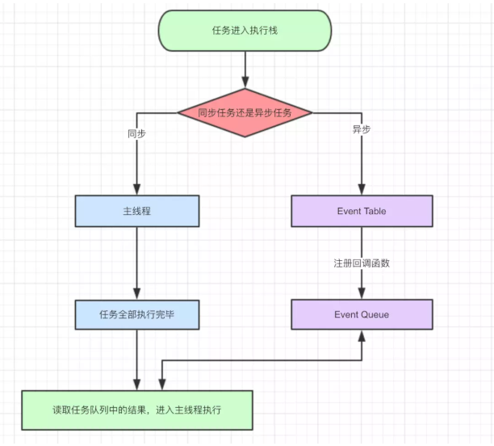
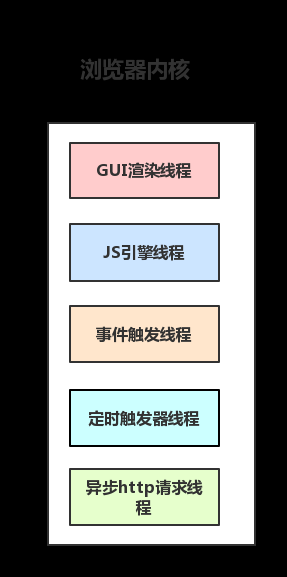

# JS引擎线程

参考：

* [MDN](https://developer.mozilla.org/zh-CN/docs/Web/JavaScript/EventLoop)
* 操作系统书籍
* [从浏览器多进程到JS单线程](https://segmentfault.com/a/1190000012925872)
* [chromium callback](https://chromium.googlesource.com/chromium/src/+/master/docs/callback.md)
* [chromium threading_and_tasks](https://chromium.googlesource.com/chromium/src/+/master/docs/threading_and_tasks.md#Tasks)
* [chromium message_loop](https://src.chromium.org/viewvc/chrome/trunk/src/base/message_loop/)

## JS 引擎线程与 GUI 渲染线程互斥

首先，浏览器分为 JS 引擎和 GUI 渲染引擎，渲染引擎就是 HTML/CSS 的渲染操作，也就是 DOM 相关的操作。

他们之间的互斥最典型的案例 js 代码进入死循环了，当 js 代码进入死循环之后，你会发现之前写的 CSS 样式都不能响应了。当然，可能浏览器也卡住了，因为过度的占用 CPU 了。

同理，有的时候我们开一些渲染难度十分大，比如一些 3D 网页游戏，而且没有开启 GPU 加速的网页的时候，我们就可能被渲染引擎给卡死。

> 浏览器为了能够使得 JS 内部 task 与 DOM 任务能够有序的执行，会在一个 task 执行结束后，在下一个 task 执行开始前，对页面进行重新渲染。

他们二者间的关系非常像是两段 C++ 代码互斥运行，但他们没有用多线程的互斥锁，因为 JS 是单线程的，不过浏览器底底层 C++ 肯定多线程的。JS 引擎跟 GUI 渲染引擎并不是各自申请了一个系统进程，而是二者是共用一个底层 C++ 所创建的窗口线程。也就是一个窗口一个线程，这一个线程中就包含了 JS 引擎和渲染引擎。

> 这些只是猜测，我没有去看过各个浏览器的源码，只是他们的互斥跟以前写的代码场景很像，我就这样去理解。

这种感觉跟 CPython 很像，CPython 中有个全局锁导致了其运行起来必定是单线程的，包括里面的协程也是单线程，这样大大阻止了对多核 CPU 的有效利用。但是单线程却使得开发变得很简单，不需要考虑各种锁、信号量的问题，而且因为是单线程，没有资源竞争就没有死锁，这个就很舒服，因为资源竞争导致的死锁调试起来几乎是不可能的。

> CPython 中的协程是使用时间片轮询的，但是。

## JS 的异步执行

这个其实没什么难以理解的，本身操作系统就遍地都是异步操作，最常见的就是硬盘的驱动程序了。

首先要明白，硬盘本身是一个小电脑，事实上几乎所有的电脑 I/O 设备，比如显卡、显示屏、音箱、路由器甚至是插座，其内部都是一台嵌入式电脑，都可以跑二进制文件。当 CPU 发出读取数据的请求时，CPU 是不会等待数据读取完毕的，而是去干其他的事情。那么谁去读取数据呢？是硬盘本身去读取数据，因为其本身带有 CPU，当硬盘读取数据完毕之后就会向电脑发出读取完毕的信号。而操作系统收到硬盘发来的读取完毕的信号之后，才去处理这些数据，这样就避免浪费 CPU。

而在上那么一个抽象一层次，操作系统中的软件，其实也是这样干的，比如 Node 读取文件时，发出了读取请求给操作系统，之后 Node 就不管了，一直到操作系统将数据读取完毕之后，Node 才去处理这些数据。

更进一步，操作系统是怎么知道硬盘已经准备好数据了呢？很简单，每隔一段时间轮询一次接口就行了。那么软件又是怎么知道操作系统拿到数据了呢？也很简单，也是轮询一个操作系统提供给的接口即可，这个接口也就是所谓多路复用技术 select、poll 和 epoll 了。

有了上面的铺垫，让我们分析一下 ajax 是怎么回事：

```js
$.ajax({
    url: 'localhost:10086/data.json',
    data: {},
    succese: function() {
        console.log("async");
    }
});
console.log("sync");
```

> 先执行同步输出 sync，然后等 ajax 的响应回来后，输出 async。

来张图：



1. JS 自上而下的读取代码，如果读取到异步任务，就直接提交给浏览器 Event Table，告诉浏览器帮我执行这个东西，而且执行完之后要将我给的回调函数注册进 Event Queue。
2. JS 引擎在执行完同步代码之后，就回去查看 Event Queue 中有没有任务，这个时候就是不断的轮询查看 Event Queue，因为此时底层浏览器对文件的读取可能还没完成或者是 HTTP 请求还没有响应的结果。
3. 直到有任务完成了，浏览器才会将 JS 给的回调函数放入 Event Queue 中，这时候 JS 引擎轮询查到里面有任务了，就开始快乐的运行起来。

引擎自上而下的运行，一旦遇见异步任务，就直接丢给 Event Table 告诉浏览器要处理这里的数据请求，然后就撒手不管了，等 JS 引擎执行完同步任务之后就轮询 Event Queue。而浏览器在完成了 JS 引擎下发的任务（I/O请求）之后，就将 JS 引擎之前注册的函数放到 Event Queue 中去。之后 JS 引擎轮询发现 Event Queue 里面出现了一个函数，于是就快乐的运行起来。

::: tip

这里就类似于操作系统跟磁盘驱动器之间的关系，JS 引擎就像是操作系统，而浏览器就像是硬盘驱动。浏览器总是为 JS 引擎服务，特别是 I/O 类型的读取全部都移交给了浏览器处理，就跟硬盘驱动的功能一样一样的。

:::

列举一些浏览器中常用的线程：

1. GUI渲染线程

   - 负责渲染浏览器界面，解析HTML，CSS，构建DOM树和RenderObject树，布局和绘制等。
   - 当界面需要重绘（Repaint）或由于某种操作引发回流(reflow)时，该线程就会执行
   - 注意，**GUI渲染线程与JS引擎线程是互斥的**，当JS引擎执行时GUI线程会被挂起（相当于被冻结了），GUI更新会被保存在一个队列中**等到JS引擎空闲时**立即被执行。

2. JS引擎线程

   - 也称为JS内核，负责处理Javascript脚本程序。（例如V8引擎）
   - JS引擎线程负责解析Javascript脚本，运行代码。
   - JS引擎一直轮询着任务队列，浏览器将任务加入队列 JS 引擎就加以处理，一个Tab页（renderer进程）中无论什么时候都只有一个JS线程在运行JS程序
   - 同样注意，**GUI渲染线程与JS引擎线程是互斥的**，所以如果JS执行的时间过长，这样就会造成页面的渲染不连贯，导致页面渲染加载阻塞。

3. 事件触发线程

   - 归属于浏览器而不是JS引擎，用来控制事件循环（可以理解，JS引擎自己都忙不过来，需要浏览器另开线程协助）
   - 当JS引擎执行代码块如setTimeOut时（也可来自浏览器内核的其他线程,如鼠标点击、AJAX异步请求等），会将对应任务添加到事件线程中
   - 当对应的事件符合触发条件被触发时，该线程会把事件添加到待处理队列的队尾，等待JS引擎的处理
   - 注意，由于JS的单线程关系，所以这些待处理队列中的事件都得排队等待JS引擎处理（当JS引擎空闲时才会去执行）

4. 定时触发器线程

   - 传说中的`setInterval`与`setTimeout`所在线程
   - 浏览器定时计数器并不是由JavaScript引擎计数的,（因为JavaScript引擎是单线程的, 如果处于阻塞线程状态就会影响记计时的准确）
   - 因此通过单独线程来计时并触发定时（计时完毕后，添加到事件队列中，等待JS引擎空闲后执行）
   - 注意，W3C在HTML标准中规定，规定要求setTimeout中低于4ms的时间间隔算为4ms。

5. 异步http请求线程

   - 在XMLHttpRequest在连接后是通过浏览器新开一个线程请求
     - 将检测到状态变更时，如果设置有回调函数，异步线程就**产生状态变更事件**，将这个回调再放入事件队列中。再由 JS 引擎执行。

   

   > [图源](https://segmentfault.com/a/1190000012925872?utm_source=tag-newest)

## 随 Promise 而来的微任务

参考：

* [Tasks, microtasks, queues and schedules 此文极佳](https://jakearchibald.com/2015/tasks-microtasks-queues-and-schedules/)

* [知乎 此文甚佳](https://www.zhihu.com/question/36972010/answer/71338002)

Promise 对 C++ 的底层提出了要求，要求实现一个新的概念：microtask，因此支持 Promise 的浏览器任务事件的思想出现了改变。

那么 ES6 中的 JS 中分为两种任务类型：**macrotask 和 microtask**，在ECMAScript中，microtask 称为`jobs`，macrotask可称为`task`。

看看都有哪些：

- macro-task(宏任务)：script（全局代码），setTimeout，setInterbal，setImmediate，I/O，UI rendering。
- micro-task(微任务)：process.nextTick，Promises（浏览器），Object.observe（已废弃），MutationObserver

> 可以看到，事件队列中的每一个事件都是一个 macrotask

那么它们之间的区别在于执行顺序的不同：

* 浏览器为了能够使 JS 内的 DOM 任务能够有序的执行，会在一个宏任务执行结束后，在下一个宏任务执行开始前，对页面进行重新渲染。此时的顺序是`宏任务->渲染引擎->宏任务(事件队列)->渲染->宏任务(事件队列)`
* 而微任务则是见缝插针，插在了宏任务与渲染引擎之间。此时变成了 `宏任务->微任务->渲染引擎->宏任务(事件队列)->微任务->渲染->宏任务(事件队列)`

其实微任务的思想异常简单，就是等待宏任务全部都执行完毕之后，在执行微任务，当这些都做完后 JS 引擎就将运行移交给渲染引擎，渲染完后继续执行宏任务（此时的宏任务将从事件队列中获取）。

::: tip

理解的核心是抛弃以往仅有异步任务和同步任务的思想，改为宏任务与微任务的思想。

:::

总结下运行机制：

- 执行一个宏任务（栈中没有就从事件队列中获取，同步代码会入栈，异步代码如事件队列）

- 执行过程中如果遇到微任务，就将它添加到微任务的任务队列中

- 宏任务执行完毕后，立即执行当前微任务队列中的所有微任务（依次执行）

- 当前宏任务执行完毕，开始检查渲染，然后GUI线程接管渲染

- 渲染完毕后，JS线程继续接管，开始下一个宏任务（栈从事件队列中获取宏任务）

  

> 其实第一宏任务肯定是运行这个脚本，而之后的的宏任务就全部都从事件队列中取了。

::: warnig Node.js

在 node 环境下，process.nextTick 的优先级高于 Promise__，只是因为在 Node 中就是这样跑的而已，_tickCallback 在每一次执行完 TaskQueue 中的一个任务后被调用，而这个 _tickCallback 中实质上干了两件事：

1. 将 nextTickQueue 中所有任务执行掉

2. 第一步执行完后执行 _runMicrotasks 函数，执行 microtask 中的部分(promise.then注册的回调)

   所以很明显 Node.js 微任务中的执行顺序 process.nextTick > promise.then

:::

贴出提问者的代码来加深理解：

```js
setTimeout(function(){console.log(4)},0);
new Promise(function(resolve){
    console.log(1)
    for( var i=0 ; i<10000 ; i++ ){
        i==9999 && resolve()
    }
    console.log(2)
}).then(function(){
    console.log(5)
});
console.log(3);
```

结果是：

```text
1,2,3,5,4
```

第一行运行时，因为这个是异步的宏任务，所以加入到事件队列中去。

然后执行 因为 new Promise 内除了 resolve 以外都是同步运行的，所以运行同步代码 console.log(1)，也就是说在 i == 9999 的时候 resolve 作为微任务被存放，然后循环作为同步继续运行，循环完成后执行 console.log(2)，之后继续运行同步代码 console.log(3)。接下来就是重中之重，同步全部完成此时的执行栈已经是空，开始执行微任务 console.log(5)，微任务全部完成。JS 引擎开始轮询任务队列，发现 setTimeout 中的回调函数(是回调，不是setTimeout)已经被放置到任务队列，取出事件队列中的宏任务 console.log(4)。

完全符合  `宏任务->微任务->渲染引擎->宏任务(事件队列)->微任务->渲染->宏任务(事件队列)` 的运行机制。

> 这里理解的核心在于，虽然 setTimeout 也是宏任务，但是他并没有被加入执行栈中，因为这是浏览器的 API，在浏览器完成并将回调函数注册进 Event Queue 中前，它不会被运行。

再来一个爽一下：

```js
console.log('script start');

setTimeout(function() {
  console.log('setTimeout');
}, 0);

Promise.resolve().then(function() {
  console.log('promise1');
}).then(function() {
  console.log('promise2');
});

console.log('script end');
```

> script start
> script end
> promise1
> promise2
> setTimeout

因为 Promise.resolve().then(...) 的 resolve 是微任务，而 then 中的第一个传入的函数其实就是 resolve，因此里面的内容被加入到微任务中去。而 JS 引擎执行完全部同步代码后，执行微任务，然后再从事件队列中取 setTimeout 任务。

/*

## 令人抓狂的浏览器差异

参考：

* [Tasks, microtasks, queues and schedules](https://jakearchibald.com/2015/tasks-microtasks-queues-and-schedules/)

*/


## node.js 的 Event Loop

Node.js 中的 JS 引擎跟 Chrome 中的 JS 引擎是一样的，但是其事件循环有所不同，Node.js 并没有使用 chromium 中的事件循环，而是用了第三方 libuv 库来做，libuv 是一个开源的跨平台的异步 I/O 库。

Node.js 同样是采用单线程的 Event Loop，但是它的运行机制不同于浏览器环境。chrome 的 Event loop 是在 HTML5 中定义的规范，见[threading_and_tasks](https://chromium.googlesource.com/chromium/src/+/master/docs/threading_and_tasks.md#Tasks)，而 node 中则由 [libuv库](https://github.com/libuv/libuv) 库实现。

所以 Node 在事件循环的步骤可能跟浏览器不同：

- 1.v8 引擎解析 JavaScript 脚本。
- 2.解析后的代码，调用底层 Node C++ API。
- Node API 通过 libuv 来设计 Event Loop。将不同的任务分配给不同的线程，形成一个 Event Loop（事件循环），以异步的方式将任务的执行结果返回给 V8 引擎。
- 4.最后 V8 引擎将结果返回给用户。