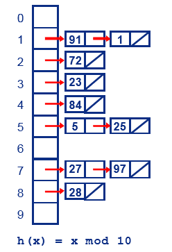

# 模拟Map

参考：

* [MDN](https://developer.mozilla.org/zh-CN/docs/Web/JavaScript/Reference/Global_Objects/Map)

一个 Map 说白了就是个链表，先通过对象（指针）来达到存储任意数据类型的目的，然后将传入的键值通过 hash 算法来计算要存储的地址，最后应该会应用某一种解决某种哈希冲突的算法。

很明显可以看出 Map 涉及到了地址空间的读写操作，是不可能用 JS 真正实现的，必须要用能操控指针的语言来实现：C/C++、Rust。所以只能是模拟一下，这种模拟的行为更类似于用一个动态语言实现了一个动态一样那样奇葩~不过用于理解是足以。

> 同时 Map 是个链表，所以增删改都要快一些，但是查就要慢于数组（顺序表）。

## 思路

Map 的特点：

1. 键不会重复，键一样的话，后面的会覆盖前面的。
2.  `Map` 的键可以是**任意值**，包括函数、对象、基本类型。
3. 具有 set、get、delete、has、clear 等方法。

我不知道内部是怎么实现这里的哈希冲突使用哈希桶（哈希拉链法）来解决。

哈希桶很简单，就是哈希计算的值一样时，就链接在后面，所以也被称为拉链法：



只要算出来的值一样，就放在最后面连接起来。比如 91 模 10 为 1，1 模 10 也为 1，所以 1 就连接在 91 后面，是不是很直白。同时，很容易可以发现，这些其实都是单向链表。

> 哈希桶排序：因为算法是使用了哈希函数把序列划分到对应的桶里面，所以本排序算法取名为哈希桶排序。

## 实现

### 初始化

初始化哈希桶，也没有什么数据，分配四个桶就行了。

```js
function myMap() {
    this.bucketLength = 4;
    this.init();
}

myMap.prototype.init = function() {
    //初始化
    this.bucket= new Array(this.bucketLength);
    for (let i = 0; i < this.bucket.length; i++) {
        this.bucket[i] = {
            type: "bucket_" + i,
            next: null
        }
    }
}
```

### 计算哈希

1. 哈希算法就是为了快速，其快速建立在均衡的空间分配上，string 类型的 key 是数量最多的，因此尽量将 string 均衡的分配到各个空间，所以 string 类型的处理可能返回空间内的任意一个桶。其他的数量太少，随便定死一个得了。

2. 哈希计算的方式很多，只要尽可能均衡的映射在某段空间即可。这里简单用对传入字符串的后三位取模来计算，其目的是映射在地址空间中，所以模数为地址空间的大小：

```js
myMap.prototype.doHash = function(key) {
    let hash = 0;
    let keyType = typeof key;
    switch (keyType) {
    case "string":
        let calcStrNum = key.length < 3 ? key.length : 3;
        for (let i = 0; i < calcStrNum; i++) {
            hash += key[i] ? key.charCodeAt(i) : 0;
        }
        break;
    case "number":
        // 规定传入 NaN 为 0
        hsah = Objec.is(keyType, NaN) ? 0 : key;
        break;
    case "object":
        // null {} []
        hash = 1;
        break;
    case "boolean":
        // true false 转为 1、0
        hash = Number(key)
        break;
    default:
        // undefined function(){}
        hash = 2
        break
    }
    return hash % key.length
}
```

在 switch 中我们考虑到的情况有 string、number、object

> 这里要注意 JS 的设计缺陷 NaN == NaN 会返回 false，所以需要用 Object.is(NaN, NaN) 返回 true 来判断。NaN  可是 number 类型。
>
> 还有 null 是 object 类型的......真是奇葩，真是奇葩，真是奇葩。


### 实现 set:

这里的思想跟 C 语言中的链表是一样一样的，都是单向链表，每一个桶就是一个单向链表。

一个单向链表，是由数据与下一个连接地址 next 组成的。

```js
// 第一个元素是头部，如果只有头部元素，那么就相当于直接返回 false
myMap.prototype.set = function(key, value) {
    let hash = this.doHash(key);
    let nowObj = this.bucket[hash];
    let isNofound = true
    while (nowObj.next) {
        if (nowObj.next.key === key) {
            isNofound = false
            nowObj.next.value = value;
        }
        nowObj = nowObj.next;
    }
    if (isNofound) {
        nowObj.next = {
            key,
            value,
            next: null
        }
    }
}
```

### 实现 get：

```js
myMap.prototype.get = function (key) {
    let hash = this.doHash(key);
    let nowObj = this.bucket[hash];
    while(nowObj.next) {
        if(nowObj.next.key === key) return nowObj.next.value
    }
    return false
}

```

### 实现 has：

```js
myMap.prototype.has = function (key) {
    let nowObj = this.bucket(key);
    while(nowObj.next) {
        if(nowObj.next.key === key) return true
    }
    return false
}
```

### 实现 delete：

本来此处要注意会出现野指针，不过垃圾回收的标记清除法会将无标记的资源给回收，因为原本的 nowObj.next 将会被替换，且没有任何东西指向它的话，自动就销毁了。

```js
myMap.prototype.delete = function (key) {
    let hash = this.doHash(key);
    let nowObj = this.bucket[hash];
    while(nowObj.next) {
        if (nowObj.next.key === key) {
            nowObj.next = nowObj.next.next;
            return true
        }
    }
    return false
}
```

### 实现 clear：

```js
myMap.prototype.clear = function () {
    this.init();
}
```


